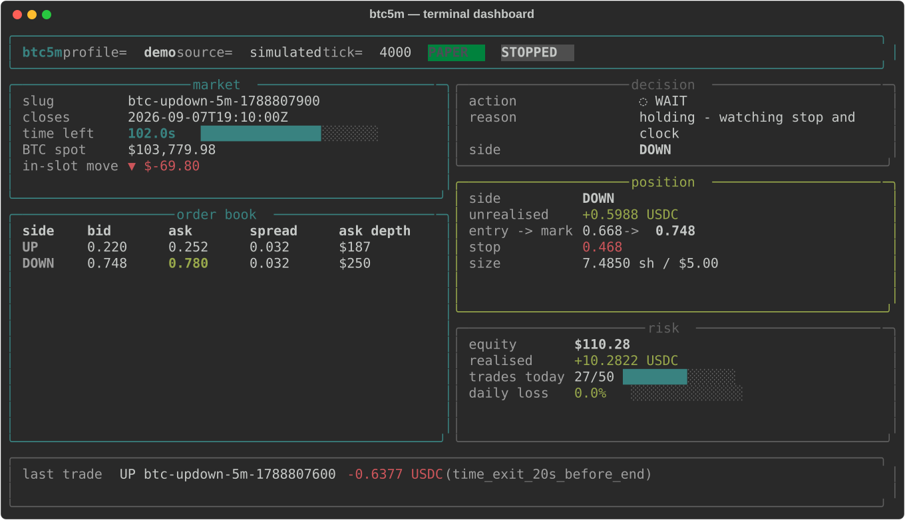

# btc5m — BTC 5-minute Up/Down toolkit for Polymarket

A rebuild of [Novals83/5min-btc-polymarket](https://github.com/Novals83/5min-btc-polymarket)
with two front-ends over one tested core:

| | |
|---|---|
| **Terminal** | `btc5m tui` — a live console dashboard |
| **Web** | a hardened FastAPI console with authentication, CSRF, rate limiting and a kill switch |

Both drive the same engine, so a profile behaves identically whichever one you
are looking at.



> **Not financial advice.** This is operational infrastructure. Live trading is
> off by default and takes two deliberate opt-ins to enable. Set your own caps.

---

## Why this rebuild exists

The original repository was a working idea wrapped in code that could not be
run, reviewed or tested by anyone but its author. The strategy it documented and
the strategy it executed were different strategies.

| Documented in v1 | Actually implemented in v1 | Here |
|---|---|---|
| Entry around **~120s left**, ±30s | Only a *lower* bound (`>= 60s`); it would enter at 4m left | Both bounds, from `session_timing` |
| Confirm a **$70–$100 BTC move** | No spot price feed existed at all | `impulse_filter`, with Binance/Coinbase/offline feeds |
| **Follow momentum, never fade it** | Side chosen purely by which ask was higher | Entry refused when the book contradicts the move |
| `skip_if_spread_gt`, `skip_if_top_ask_notional_usd_lt` | Never read; the CLOB client discarded resting size | Enforced from the real book depth |
| `daily_max_loss_pct`, `max_trades_per_day` | Never read | Enforced, and they **survive a restart** |
| Hedge on extreme skew | Config present, no code path | Implemented, and unreachable hedge windows are rejected at load |
| `config/btc_5m_profiles.yaml` | Ignored — a hard-coded `PROFILES` dict won | The YAML is the only source of truth |

Beyond the strategy gap:

* **It could not be run.** Every path shelled out to a private sibling repo and
  funded API credentials. A `paper` executor now runs the full pipeline offline,
  so the project is reviewable, testable and demoable.
* **It could not be tested.** One 673-line `main()` interleaved HTTP calls,
  subprocess launches and trading rules. Now the rules are pure functions and
  there are 121 tests.
* **It could not be watched.** The old runner printed one JSON blob at exit;
  stopping it meant `SIGKILL`. A session is now an object with a `tick()` that
  publishes an immutable snapshot, which is exactly what both UIs render.
* **It could hang past market close.** `subprocess.run` had no timeout, so one
  stuck HTTP call froze the session holding an open position. Every subprocess
  is now bounded.
* **Its stdout parser was wrong.** The hand-rolled brace counter miscounted
  braces inside JSON strings, silently dropping the order result whenever an
  error message contained a `{`.
* **It marked positions off the wrong price.** Stop-losses were checked against
  the Gamma indicative price rather than the best bid, so they fired on prices
  nobody was bidding.

`docs/CHANGES.md` has the full list.

---

## Quick start

```bash
pip install -r requirements.txt

# Terminal dashboard, offline simulator, zero risk
python -m btc5m.cli tui --profile demo --source simulated

# Web console on http://127.0.0.1:8000
BTC5M_WEB_HTTPS=0 BTC5M_WEB_READONLY=0 \
  python -m uvicorn web.app:app --host 127.0.0.1 --port 8000
```

With no credentials set, the web console prints a one-off random password to its
log at startup. Set `BTC5M_WEB_PASSWORD_HASH` for anything beyond local use.

`make help` lists the rest.

### Guía rápida (español)

```bash
pip install -r requirements.txt

# Consola de terminal contra el simulador offline (riesgo cero)
python -m btc5m.cli tui --profile demo --source simulated

# Consola web en http://127.0.0.1:8000
BTC5M_WEB_HTTPS=0 BTC5M_WEB_READONLY=0 \
  python -m uvicorn web.app:app --host 127.0.0.1 --port 8000
```

El perfil `demo` **nunca** ejecuta órdenes reales: usa el motor completo con
ejecución simulada. Para operar en real hacen falta dos confirmaciones
explícitas (`--execute` y confirmación interactiva) y el repositorio privado de
ejecución de órdenes. Los topes de riesgo (`daily_max_loss_pct`,
`max_trades_per_day`) se aplican de verdad y **sobreviven a un reinicio**.

---

## The terminal version

```bash
btc5m tui --profile conservative --source polymarket   # watch the live market
btc5m tui --profile demo         --source simulated    # offline, deterministic
```

The dashboard shows the active slot and its countdown, BTC spot with the in-slot
move, both sides of the book with spread and resting depth, the current decision
*and the coded reason for it*, any open position with its stop, and the live risk
ledger. `Ctrl-C` exits cleanly rather than abandoning a position.

Other subcommands:

```bash
btc5m run      --profile demo --max-ticks 20   # headless, JSON snapshot on stdout
btc5m report   --limit 25                      # PnL report from the trade store
btc5m profiles --profile aggressive            # the fully-resolved profile
btc5m doctor   --source polymarket             # preflight checks
```

## The web version

`docker compose up -d web`, or run uvicorn directly. What it enforces:

| Control | Behaviour |
|---|---|
| Authentication | Argon2id; a failed login costs the same whether or not the user exists |
| Sessions | Server-side registry, signed opaque cookie, `HttpOnly` + `SameSite=Strict` + `Secure`; idle **and** absolute timeouts; logout genuinely revokes |
| CSRF | Required on every state change, as a form field or `X-CSRF-Token` |
| Brute force | Per-IP attempt counter with a lockout window |
| Rate limiting | Per-IP token bucket in front of `/api` |
| CSP | `default-src 'none'`, no inline script or style anywhere, `frame-ancestors 'none'` |
| Headers | HSTS (under TLS), `nosniff`, `DENY`, `no-referrer`, `no-store`, COOP/CORP |
| Read-only default | Controls refused unless `BTC5M_WEB_READONLY=0`. The kill switch always works |
| Host allow-list | `BTC5M_WEB_ALLOWED_HOSTS` |
| API surface | OpenAPI and the docs UIs are disabled |
| Secrets | Config is exposed through an allow-list that cannot return one; logs pass through a redaction filter |

34 of the 121 tests assert these properties directly.

> Serve it over TLS behind a reverse proxy. `BTC5M_WEB_HTTPS=1` (the default)
> marks cookies `Secure`, so a browser on plain `http://` will withhold the CSRF
> cookie — the login page says so explicitly rather than failing with a bare 403.

### Deploying

```bash
cp .env.example .env          # then set BTC5M_WEB_PASSWORD_HASH and BTC5M_WEB_SECRET
docker compose up -d web      # bound to 127.0.0.1:8000
docker compose run --rm tui   # terminal dashboard against the same store
```

The container runs as UID 10001 with a read-only root filesystem, all
capabilities dropped and `no-new-privileges`. Only the `/data` volume is
writable.

Generate the two secrets on the host:

```bash
python -c "from web.auth import hash_password; print(hash_password('your-password'))"
python -c "import secrets; print(secrets.token_urlsafe(48))"
```

---

## Configuration

`config/btc_5m_profiles.yaml` is the single source of truth. `shared_rules`
supplies defaults and each profile deep-merges its overrides on top. Every value
is validated at load: an out-of-range number, a wrong type or an incoherent
combination aborts startup naming the exact YAML path.

Three profiles ship: `conservative`, `aggressive`, and `demo` (paper-only, which
the CLI refuses to run with `--execute`).

```yaml
shared_rules:
  session_timing:
    min_entry_seconds_left: 90     # entry window, lower bound
    max_entry_seconds_left: 150    # upper bound — v1 had none
    exit_before_sec: 20
  execution_safety:
    skip_if_spread_gt: 0.03
    skip_if_top_ask_notional_usd_lt: 30
  impulse_filter:
    enabled: true
    btc_move_usd_min: 70           # the documented $70-$100 confirmation
    require_direction_match: true  # follow momentum, never fade it
```

The loader rejects configurations that cannot work, such as a hedge whose
trigger window closes before entries are even allowed — the class of dead
parameter v1 was full of.

## Live trading

Live orders still delegate to `src/live/pm_live_trade_runner.py` in the private
trading repo, as before. Enabling them takes:

1. `--execute` on the command line,
2. an interactive `yes` (or `--yes`),
3. a profile other than `demo`,
4. `BTC5M_REPO` pointing at a checkout that passes preflight.

```bash
btc5m doctor --source polymarket --repo /path/to/pm-hl-conservative-plus-repo
btc5m tui --profile conservative --source polymarket --repo /path/... --execute
```

This project never reads, stores or logs your Polymarket credentials — the child
process picks them up from its own environment, and log records pass through a
redaction filter on the way out.

## Architecture

```
btc5m/
  config.py       profile loading, deep merge, validation
  models.py       frozen value objects (Market, Quote, Impulse, Decision, ...)
  strategy.py     entry and exit rules — pure functions
  risk.py         daily caps, circuit breaker, kill switch
  engine.py       the session state machine; publishes Snapshot
  store.py        SQLite trades and events
  sources/        polymarket (live) · price (spot feeds) · simulated (offline)
  executors/      paper (simulated fills) · live (delegates to the order runner)
  tui.py          terminal dashboard — a pure function of a Snapshot
  cli.py          tui · run · report · profiles · doctor
web/
  app.py          routes; settings.py · auth.py · security.py · runner.py
```

The dependency arrow only ever points inward: `strategy` and `risk` import no
I/O, `engine` knows nothing about which executor it holds, and both UIs consume
the same `Snapshot`.

## Tests

```bash
pip install -r requirements-dev.txt
pytest
```

121 tests, no network, no credentials, no trading repo. They cover profile
merging and validation, every entry and exit rule, the risk caps, paper fills,
the live runner's output parser, engine state transitions against a frozen
clock, persistence, and the web hardening listed above.

## License

MIT, as upstream.
